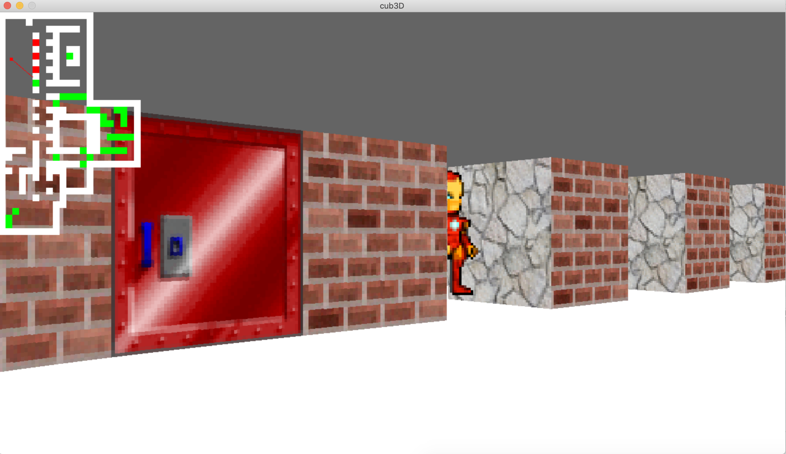

# cub3d_42

## Group project:
## [hzona](https://github.com/maminparen)
## [cdarrell](https://github.com/crowcbr)

First-person 3D representation of a maze using raycasting, similar to Wolfenstein 3D (1992).

### Prerequisites

The project runs using the MiniLibX, a simplified version of the Xlib. It can therefore only run in MacOSX, preferably on a computer with a solid CPU !

### The game

### Acknowledgments

* The Coding Train (raycasting inspiration)
* Wolfenstein 3D (for the controversial textures)
* And macrespo (for this beautiful life bar)
